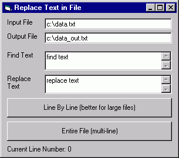



## Replace text in file

### Description

Reads a file, replaces all occurrance of a string with a new string and writes result to a new file.

This is a very simple program, but it works tons faster than Notepad's (and many other programs') replace for large files. Note: The "Entire File" option allows replacing text accross lines, but requires reading whole file at once, so it won't work well for large files. Possible enhancements would be multi-file support, file open dialogs, command line options, etc. I may add some of these features if requested or if I find use for them.
 
### More Info
 

             |
---                |---
**Submitted On**   |2000-10-09 09:59:28
**By**             |[Andy Pearson](https://github.com/Planet-Source-Code/PSCIndex/blob/master/ByAuthor/andy-pearson.md)
**Level**          |Beginner
**User Rating**    |4.4 (22 globes from 5 users)
**Compatibility**  |VB 6\.0
**Category**       |[Complete Applications](https://github.com/Planet-Source-Code/PSCIndex/blob/master/ByCategory/complete-applications__1-27.md)
**World**          |[Visual Basic](https://github.com/Planet-Source-Code/PSCIndex/blob/master/ByWorld/visual-basic.md)
**Archive File**   |[CODE\_UPLOAD105381092000\.zip](https://github.com/Planet-Source-Code/andy-pearson-replace-text-in-file__1-11965/archive/master.zip)

